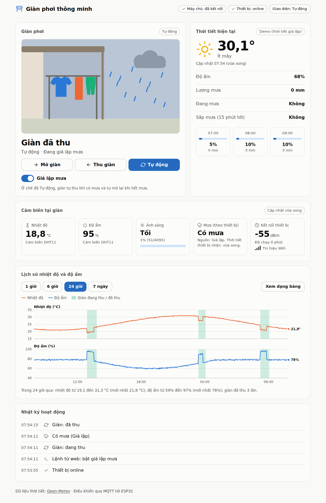
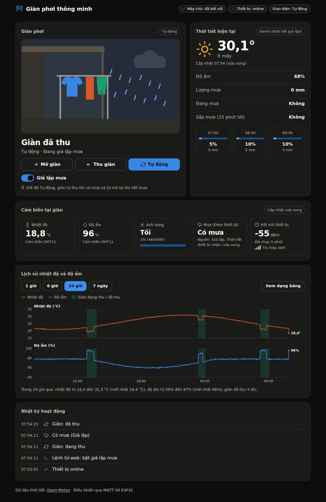
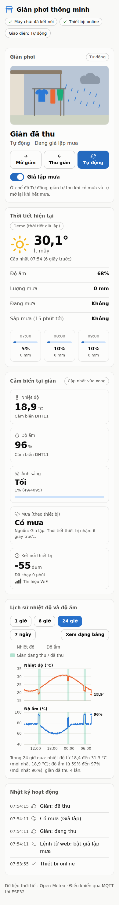

# Giàn phơi thông minh (PTIT IoT – nhóm 10)

Hệ thống IoT giám sát thời tiết và **tự động thu giàn phơi khi trời mưa**, kèm website để xem trạng thái, xem thời tiết và điều khiển giàn.



<details><summary>Giao diện tối và điện thoại</summary>



</details>

```
ESP32 ──MQTT (LAN :1883)──> Mosquitto <──MQTT──> Backend (Go) ──REST + WebSocket──> Trình duyệt
 │  DHT11, quang trở, cảm biến mưa,                  │  SQLite (lịch sử)
 │  OLED, relay (giàn), nút, buzzer                  └──> Open-Meteo (thời tiết, miễn phí)
```

## Chạy thử ngay, không cần phần cứng

Chỉ cần Go (1.22 trở lên):

```bash
make demo            # hoặc: cd backend && go run ./cmd/demo
# mở http://127.0.0.1:8080
```

Lệnh này chạy **cả hệ thống trong một tiến trình**: broker MQTT nhúng, backend, một ESP32 giả (nói đúng giao thức MQTT như firmware thật) và thời tiết giả
xoay vòng 4 phút (nắng → sắp mưa → mưa) nên bạn thấy giàn tự thu và tự mở lại. Bấm **Thu giàn / Mở giàn / Tự động**, bật **Giả lập mưa**, xem biểu đồ.
Tuỳ chọn để xem các trạng thái khó gặp: `-device=false` (thiết bị offline), `-no-weather` (mất nguồn thời tiết), `-token abc` (đòi mã truy cập), `-live-weather` (Open-Meteo thật),
`-rain-offset 3m10s` (bắt đầu ngay giữa pha mưa: tấm cảm biến mưa giả "ướt"). Xem `go run ./cmd/demo -h`.

## Chạy thật

Cần một máy luôn bật trong cùng mạng LAN với ESP32 (laptop, mini-PC, Raspberry Pi) để chạy broker và backend.

1. **Broker MQTT + backend** (Docker):
   ```bash
   cd deploy
   ./mosquitto/gen-passwd.sh                       # tạo tài khoản MQTT cho thiết bị và backend
   cp ../backend/.env.example ../backend/.env      # điền MQTT_USER=backend, MQTT_PASSWORD, toạ độ (WEATHER_LAT/LON)
   docker compose up -d --build                    # web: http://<IP máy>:8080
   ```
   Mọi lệnh `docker compose` phải chạy trong thư mục `deploy/` (nơi có `docker-compose.yml`). Từ thư mục gốc dùng `make up`, `make ps`, `make logs`, `make down`.
   Kiểm tra: `make ps` báo hai dịch vụ đang chạy, và `curl http://localhost:8080/healthz` trả `"mqtt_connected":true` (thêm `"device_online":true` khi ESP32 đã nối).

   Không dùng Docker? Cài Mosquitto 2.0.x, chép `deploy/mosquitto/mosquitto.conf` rồi đổi ba đường dẫn `/mosquitto/...` (file mật khẩu, ACL, thư mục dữ liệu) thành đường dẫn thật;
   hai file đầu phải đọc được bởi tài khoản chạy Mosquitto. Sau đó `cd backend && go run ./cmd/server`.
2. **ESP32**: nối dây theo [`docs/wiring.md`](docs/wiring.md) (hoặc mở trang tương tác `docs/wiring-guide.html` bằng trình duyệt), copy `firmware/include/secrets.h.example` thành `secrets.h` (WiFi, IP máy chạy broker, mật khẩu thiết bị),
   rồi nạp bằng PlatformIO. Chi tiết và cách hiệu chỉnh quang trở: [`firmware/README.md`](firmware/README.md).
3. Mở web, chờ huy hiệu **Thiết bị: online**.

Chưa có board? `cd backend && go run ./cmd/simulator` chạy ESP32 giả kết nối vào Mosquitto thật.

## Phần cứng và những gì đang được "giả"

Kit ESP32 Basic Starter (board DEVKIT V1) **không có** servo; module cảm biến mưa YL-83 là phần nhóm mua thêm. Vì vậy:

| Cần | Dùng | Ghi chú |
|---|---|---|
| Biết trời mưa | **Open-Meteo API** do backend lấy rồi gửi xuống ESP32, **cộng** cảm biến mưa YL-83 (AO → GPIO35) | Open-Meteo có cả dự báo "mưa trong 15 phút tới" nên thu giàn *trước* khi ướt; tấm cảm biến cho biết "đang mưa ngay đây" nên vẫn đúng khi API sai vị trí hoặc backend mất mạng. Thiếu một trong hai thì hệ thống vẫn chạy |
| Dự phòng khi mất thời tiết | DHT11 (độ ẩm cao) **và** quang trở (trời tối) | Chỉ dùng khi dữ liệu thời tiết cũ, không quyết định một mình |
| Kéo giàn | 2 relay + 2 LED (đỏ = đang thu, xanh = đang mở) | Thay bằng motor DC + nguồn ngoài về sau, không sửa firmware |
| Giới hạn hành trình | 2 nút nhấn làm công tắc hành trình, hoặc bộ đếm giờ giả lập | `SIM_TRAVEL_MS` trong `firmware/include/config.h` |
| Điều khiển tay, cảnh báo | 1 nút nhấn (giữ 3 giây = giả lập mưa), OLED, buzzer | |

## Luật tự động (chạy trên ESP32, không phụ thuộc mạng)

| | |
|---|---|
| Mưa = | Open-Meteo báo đang mưa **hoặc** sắp mưa trong 15 phút **hoặc** cảm biến mưa báo tấm đang ướt **hoặc** đang giả lập mưa |
| Thu giàn | mưa liên tục ≥ 30 giây (cảm biến mưa: ≥ 5 giây; giả lập mưa: thu ngay) |
| Mở lại | khô liên tục ≥ 15 phút (tấm khô chỉ tính là khô khi dự báo còn mới báo không mưa) |
| Thủ công | Mở/Thu từ web hoặc nút → chế độ Thủ công, tự về Tự động sau 10 phút |
| Mất thời tiết > 30 phút | Tấm cảm biến mưa vẫn có tác dụng. Dự phòng: độ ẩm ≥ 85% **và** trời tối thì coi là mưa; ngược lại giữ nguyên |
| An toàn | không bao giờ bật hai relay cùng lúc (nghỉ 200 ms khi đảo chiều); không tới công tắc hành trình trong 30 giây thì báo lỗi và tắt relay |

Đầy đủ (kể cả vì sao thiết kế như vậy): [`docs/mqtt-topics.md`](docs/mqtt-topics.md).

## Thư mục

| | |
|---|---|
| [`firmware/`](firmware/README.md) | ESP32 (PlatformIO). Lõi điều khiển là C++ thuần, test được trên máy tính |
| [`backend/`](backend/README.md) | API + MQTT + thời tiết + lịch sử (Go). Có ESP32 giả và broker nhúng cho demo/test |
| [`frontend/`](frontend/README.md) | Website (JavaScript thuần, không cần build) |
| [`docs/`](docs) | `openapi.yaml` (REST/WebSocket), `mqtt-topics.md`, `wiring.md` (kèm `wiring-guide.html`, trang đi dây tương tác) |
| [`deploy/`](deploy) | Docker Compose, cấu hình Mosquitto (mật khẩu + ACL theo từng topic) |

**Contract** giữa các phần nằm ở `docs/`. Đổi contract thì báo cả nhóm; test của backend đối chiếu từng response với `docs/openapi.yaml`.

## Kiểm thử

```bash
make test-backend     # gofmt, vet, go test -race (gồm end-to-end qua broker MQTT nhúng)
make test-frontend    # node --test
make test-firmware    # pio test -e native (cần: pip install platformio)
make e2e              # trình duyệt thật + demo (cần: cd frontend && npm i && npx playwright install chromium)
make hostsim          # firmware thật build cho Linux + Mosquitto thật, 13 kịch bản (~9 phút, cần g++, mosquitto, paho-mqtt)
make hostsim-backend  # firmware thật + backend Go thật + Mosquitto thật (~5 phút)
```
CI (`.github/workflows/ci.yml`) chạy các bước trên cùng kiểm tra trợ năng (axe-core) và build Docker image.

## Xử lý sự cố

| Triệu chứng | Nguyên nhân thường gặp |
|---|---|
| ESP32 nối WiFi được nhưng không thấy "Thiết bị: online" | WiFi trường/công cộng bật cách ly thiết bị (AP isolation): dùng hotspot điện thoại hoặc router riêng. Kiểm tra IP trong `secrets.h` và firewall cổng 1883 |
| Đổi mạng là mất kết nối | IP máy chạy broker đổi: đặt DHCP reservation trên router |
| Cả hai LED sáng sẵn lúc đứng yên, tắt khi relay hút | Dây LED nối vào đầu NC của relay thay vì NO: chuyển sang đầu ngoài còn lại, bên kia chân giữa COM (xem `docs/wiring.md`) |
| Relay hút khi lẽ ra nhả (đảo ngược) | Module kích mức cao: đặt `RELAY_ACTIVE_LOW 0` trong `firmware/include/config.h` |
| Giàn thu khi trời sáng, mở khi trời tối | Quang trở ngược cực tính: đặt `LDR_INVERT 1` (xem `docs/wiring.md`) |
| Ô "Cảm biến mưa" luôn **Ướt** dù tấm khô (hoặc luôn Khô dù nhúng nước) | Sai nguồn hoặc dây AO, `RAIN_INVERT` sai, hoặc ngưỡng chưa hiệu chỉnh: xem `docs/wiring.md`, mục "Cảm biến mưa" và bảng sự cố trong `firmware/README.md` |
| Web báo "Mất kết nối tới máy chủ" | Backend tắt hoặc sai địa chỉ. Khi dev front-end trên server riêng: mở `?api=http://<backend>:8080` và đặt `CORS_ORIGINS` |
| Nút điều khiển bị khóa | Thiết bị offline (lệnh không được giữ lại trên broker nên không gửi được) |
| Tấm cảm biến mưa ướt, giàn thu, nhưng web đứng yên rồi báo "Thiết bị (ESP32) đang offline" (serial vẫn `mqtt=1`) | Backend đang chạy là bản cũ: nó coi `rain_source: "sensor"` là không hợp lệ và bỏ cả bản tin, nên `last_seen` không đổi. `make logs` có dòng `ignoring invalid message ... invalid rain_source "sensor"`. Cập nhật code rồi `make up` để build lại image backend (lịch sử trong volume được giữ nguyên). Backend mới thì web có ô "Cảm biến mưa" |
| Thẻ thời tiết trống | Máy chủ không ra được Internet (Open-Meteo). Sau 2 phút thiết bị vào chế độ dự phòng |

## Những điều đã kiểm chứng và chưa kiểm chứng

Trong môi trường phát triển của dự án (Linux, không có phần cứng thật) và trên GitHub Actions:

| Phần | Đã chạy và đạt |
|---|---|
| Backend | Toàn bộ test có `-race` (trên cả Go 1.22 và 1.24), gồm end-to-end qua broker MQTT nhúng; mọi response được đối chiếu với `docs/openapi.yaml` |
| Mosquitto | Cấu hình `deploy/` trên **Mosquitto 2.0.18 thật**: từ chối ẩn danh và sai mật khẩu, ACL từng topic, Last Will, retained. Backend và thiết bị giả chạy qua nó: thử lại khi nguồn thời tiết lỗi, lệnh, mưa làm giàn tự thu, giết thiết bị đột ngột |
| Firmware (logic) | `pio test -e native`: 90 test (state machine, thời tiết cũ, tràn `millis()`, interlock relay bằng fuzz, JSON đúng bộ key, cảm biến mưa: hai ngưỡng có độ trễ, giọt bắn, thứ tự ưu tiên nguồn, tấm khô không phải bằng chứng khi mất thời tiết). Kiểm thử đột biến: cài cố ý 62 lỗi vào lõi điều khiển, nút bấm và bộ mã hoá JSON (16 lỗi trong số đó nhắm vào luật cảm biến mưa), 61 lỗi bị test bắt; lỗi còn lại tương đương về hành vi (một điều kiện thừa) |
| Firmware (biên dịch) | `pio run -e esp32dev` và `-e esp32dev-demo` cross-compile thành công cho ESP32 (RAM 14%, flash 61%, không cảnh báo trong `src/`), kể cả khi đặt `RAIN_PWR_PIN=18` hoặc `RAIN_SENSOR_ENABLED=0` |
| Firmware thật + Mosquitto thật | `firmware/hostsim`: chính mã nguồn firmware (glue mạng, task, PubSubClient, ArduinoJson) build cho Linux với Arduino/WiFi/phần cứng giả, nối Mosquitto 2.0.18 với ACL của repo: 96 kiểm tra / 13 kịch bản (LWT khi bị kill, chu kỳ telemetry, độ trễ công tắc hành trình < 150 ms, thời tiết cũ và fail-safe, rớt WiFi, broker chết mà vòng điều khiển không khựng, watchdog, `millis()` tràn số, cảm biến mưa: nguồn `sensor`, hai ngưỡng có độ trễ, giọt bắn, cấp điện qua GPIO18 chỉ lúc đo) |
| Firmware thật + backend Go thật | Cùng firmware đó nối với **backend Go thật** qua Mosquitto thật và Open-Meteo giả: 28 kiểm tra đạt (lệnh web, công tắc hành trình dừng sớm, nút tay ngắn và dài, mưa giả lập, DHT lỗi thành `null`, tấm cảm biến mưa ướt làm giàn tự thu dù Open-Meteo báo khô, mưa từ Open-Meteo làm giàn tự thu rồi tự mở, rớt WiFi rồi hồi phục). Chạy lại bằng `make hostsim` và `make hostsim-backend` (không nằm trong CI vì mất khoảng 14 phút và cần Mosquitto) |
| Front-end | 42 test logic (gồm đối chiếu nhãn `rain_source` với `docs/openapi.yaml` và gộp nhật ký REST với WebSocket); kiểm thử Chromium thật: điều khiển, mưa giả lập, tấm cảm biến mưa ướt, biểu đồ, mất máy chủ rồi tự hồi phục, thiết bị offline, mất thời tiết, nhập token, di động; axe-core không có vi phạm ở chế độ sáng và tối |
| CI trên GitHub Actions | Cả 5 job đạt trên các lần push gần nhất: backend (gofmt, vet, `-race`), front-end, firmware (test native và cross-compile ESP32), trình duyệt thật + axe-core, và `docker build` image backend |

**Chưa kiểm chứng** (cần bạn thử, xem [`docs/bringup.md`](docs/bringup.md)):
- **Cảm biến mưa YL-83 trên board thật**: nhóm báo module có điện và đèn DO đổi trạng thái khi bôi nước. Chưa kiểm chứng: firmware đọc chân AO thật (chiều và dải của `rain_level`),
  hai ngưỡng `RAIN_WET_ABOVE` / `RAIN_DRY_BELOW` (400 và 200 chỉ là ước đoán, phải hiệu chỉnh theo `docs/wiring.md`, mục "Cảm biến mưa"), và chế độ cấp điện qua `RAIN_PWR_PIN`.
- **Chạy trên ESP32 thật**: cực tính quang trở, mức kích relay (một số module 5 V kích mức thấp không nhả hẳn khi chân ra 3,3 V), độ ổn định WiFi/MQTT của `WiFiClient` thật, timing thật của DHT11 và OLED,
  watchdog reset thật, và dung lượng stack của các task (net 10 KB, loop 8 KB chưa đo `high-water mark`). Phần đã chạy ở trên dùng phần cứng giả. Chưa thử Arduino core 3.x (platform được ghim ở `espressif32@6.9.0`).
- **`docker compose up`** (Mosquitto và backend chạy trong container, kể cả nhánh dùng Docker của `gen-passwd.sh`): môi trường phát triển không có Docker daemon nên compose mới chỉ được đọc lại và kiểm tra cú pháp. Riêng `docker build` image backend đã đạt trong CI. Image Mosquitto được ghim ở 2.1.2-alpine, bản đã chạy thật với cấu hình này (nạp được mật khẩu và ACL, backend nối được); các bộ kiểm thử tự động ở trên dùng Mosquitto 2.0.18.
- Gọi **Open-Meteo thật** (môi trường phát triển không ra được Internet ngoài danh sách cho phép; phần phân tích dùng dữ liệu theo đúng tài liệu API và một máy chủ giả).
